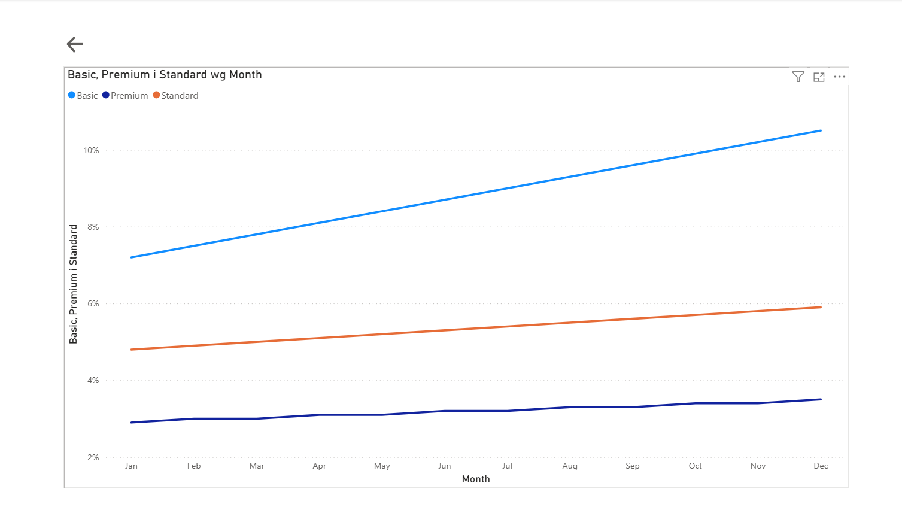

Markdown

# StreamFlow: Strategic Retention & Churn Analytics Dashboard

## Business Context & Objective / Cel i kontekst biznesowy
**[EN]** In subscription-based business models (SaaS), customer retention and Monthly Recurring Revenue (MRR) stability are critical growth drivers. This Power BI dashboard delivers actionable insights into subscription health by identifying global churn trends, segmenting revenue risk, and diagnosing underperforming acquisition channels.

**[PL]** W modelach biznesowych opartych o subskrypcję (SaaS), retencja klientów oraz stabilność miesięcznych przychodów powtarzalnych (MRR) to kluczowe czynniki wzrostu. Dashboard w Power BI dostarcza operacyjnych wniosków dotyczących kondycji subskrypcji poprzez identyfikację globalnych trendów odpływu (churn), segmentację ryzyka przychodów oraz diagnozę kanałów pozyskiwania klientów o niskiej efektywności.

---

## Tech Stack & Features / Wykorzystane technologie i funkcje
* **Tool:** Power BI Desktop
* **Data Transformation (ETL):** Power Query (data cleaning, column unpivoting, type enforcement)
* **Data Modeling:** Star Schema (1:N relationships, dedicated Calendar Dimension)
* **Analytical Calculations:** Advanced DAX (Time Intelligence, conditional filtering via CALCULATE)
* **UX/UI Design:** Custom container grid, integrated Call-To-Action navigation buttons

---

## Dashboard Architecture & Views (English Version)

### Page 1: Strategic Retention Overview
The main screen focuses on high-level executive KPIs and immediate diagnostic entry points:
* **Core KPIs:** Top-level metrics tracking Global Churn Rate vs. Target (5%), Net Subscriber Growth, Total MRR, and Monthly MRR change.
* **Executive Summary:** An integrated notification banner presenting the primary business insight directly to stakeholders.

* **Interactive Navigation:** Includes an intuitive "Call to Action" navigation element below the segmentation chart. Clicking this element leverages internal report actions to seamlessly transition the user to Page 2 for deep-dive exploratory analysis.

### Page 2: Detailed Trend Analysis (Exploratory View)
* A dedicated drill-down view containing an expanded, high-resolution line chart that analyzes the long-term historical trajectory of the churn rate, allowing managers to isolate seasonal variances and macroeconomic impacts. Includes a date-range timeline slicer for advanced filtering.

## Architektura raportu i widoki (Wersja Polska)

### Strona 1: Strategiczny Przegląd Retencji
Główny ekran koncentruje się na kluczowych wskaźnikach efektywności (KPI) dla kadry zarządzającej oraz punktach natychmiastowej diagnozy:
* **Główne Wskaźniki KPI:** Najważniejsze metryki śledzące globalny wskaźnik churnu w odniesieniu do celu (5%), przyrost netto subskrybentów, całkowity MRR oraz miesięczną zmianę wartości MRR.
* **Podsumowanie Menedżerskie:** Zintegrowany baner powiadomień prezentujący najważniejszy wniosek biznesowy bezpośrednio dla interesariuszy.

### Strona 2: Szczegółowa Analiza Trendu (Widok Eksploracyjny)
* Dedykowany widok szczegółowy zawierający rozbudowany wykres liniowy w wysokiej rozdzielczości, analizujący historyczną trajektorię wskaźnika odpływu w długim okresie, wzbogacony o suwak osi czasu dla zaawansowanego filtrowania okresów.
## Business Insights & Strategy Presentation / Prezentacja biznesowa
**[EN]** Beyond data engineering, this project delivered an executive-ready strategic proposal based on the report data. The full slide deck is available directly in the repository: 
**[View Full Strategy Presentation (PDF)](Executive_Presentation_Retention_Strategy.pdf)**

**[PL]** Poza samym przygotowaniem raportu, kluczowym elementem projektu było opracowanie propozycji strategicznej dla kadry zarządzającej. Pełna prezentacja biznesowa jest dostępna bezpośrednio w repozytorium:
 **[Zobacz pełną prezentację strategiczną (PDF)](Executive_Presentation_Retention_Strategy.pdf)**

---

## Key Business Takeaways & Recommendations (Executive Summary)

### Regional Engagement vs. Goals
* **[EN]** While the US market stays close to its target (4.8 vs 5.0 sessions/week), **Asia significantly underperforms** at 3.1 sessions/week, causing instabilities in the customer base.
* **[PL]** Podczas gdy rynek USA utrzymuje się blisko celu (4.8 vs 5.0 sesji/tydz.), **Azja pozostaje wyraźnie w tyle** (3.1 sesji/tydz.), co destabilizuje bazę użytkowników w tym regionie.

### Churn Correlation with Activity
* **[EN]** A critical correlation was diagnosed: lower session duration directly triggers higher churn. Asia faces a **7% churn rate (9-min average session)** compared to just **3% churn in the US (15-min average session)**.
* **[PL]** Zdiagnozowano krytyczną korelację: krótszy czas trwania sesji bezpośrednio napędza odpływ klientów. Azja mierzy się z **7% churnem (średnia sesja 9 min)** w porównaniu do zaledwie **3% churnu w USA (średnia sesja 15 min)**.

### Feature Adoption Feature (Workout Plans)
* **[EN]** Feature adoption tracking revealed that "Workout Plans" is a key retention driver—users interacting with this feature have **40% longer sessions**. However, adoption in Asia is only 42% (vs 65% in the US).
* **[PL]** Śledzenie adopcji funkcji wykazało, że plany treningowe ("Workout Plans") są głównym motorem retencji – użytkownicy z nich korzystający mają **sesje o 40% dłuższe**. Adopcja tej funkcji w Azji wynosi jednak tylko 42% (wobec 65% w USA).

### Strategic Actions Plan / Plan Działań Strategicznych
* **Asia (Fix - Priority):** Localize content and redesign onboarding to enforce "Workout Plans" feature adoption. Shorten time-to-session goals.
* **Europe (Scale):** Introduce loyalty programs and gamification to push engagement to the US benchmark.
* **USA (Monetize):** A/B test the new "Premium Plus" model to monetize high-loyalty user segments.

---
