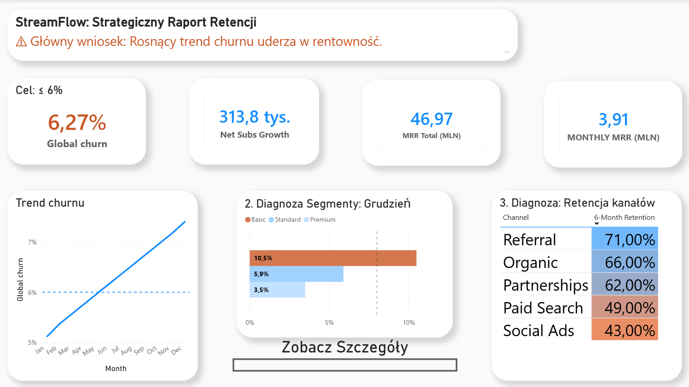

Markdown

# StreamFlow: Strategic Revenue & Churn Analytics Dashboard

## Business Context & Objective / Cel i kontekst biznesowy
**[EN]** Business Intelligence project analysing customer churn, MRR and acquisition channel performance using Power BI, DAX and Power Query.

**[PL]** Projekt z zakresu Business Intelligence analizujący odpływ klientów, MRR oraz efektywność kanałów pozyskiwania klientów z wykorzystaniem narzędzi Power BI, DAX i Power Query.

### Project Files

📊 **Power BI Dashboard (.pbix)**  
➡️ [Open Power BI report](Raport%20retencji.pbix)

📑 **Business Presentation (PDF)**  
➡️ [View presentation](Business presentation with strategic recommendations.pdf)

---
## Business Problem

A SaaS company observed increasing customer churn and declining recurring revenue.

The objective was to identify:
- which acquisition channels generate loyal customers,
- which customer segments create the highest revenue risk,
- what actions could improve retention.

## My Contribution

✔ Data cleaning with Power Query

✔ Data modelling (Star Schema)

✔ DAX measures

✔ Dashboard design

✔ KPI definition

✔ Business recommendations

✔ Executive presentation

## Tech Stack

Power BI

Power Query

DAX

## Key KPIs

• Churn Rate

• Monthly Recurring Revenue

• Net Subscriber Growth

• Revenue by Channel

• Customer Lifetime Value

## Key Insights

• Paid Search generated the highest churn.

• Referral customers had the highest retention.

• Premium subscribers created over 60% of recurring revenue.

## Recommendations

• Reduce Paid Search budget.

• Increase Referral campaigns.

• Launch win-back campaigns for high-risk users.

---
